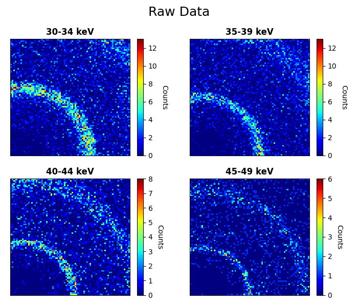
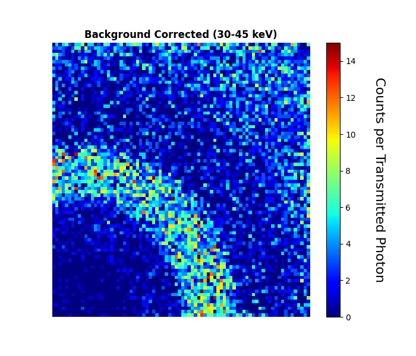
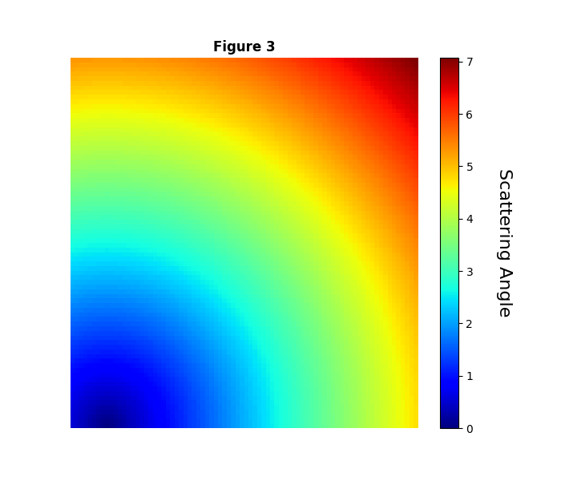
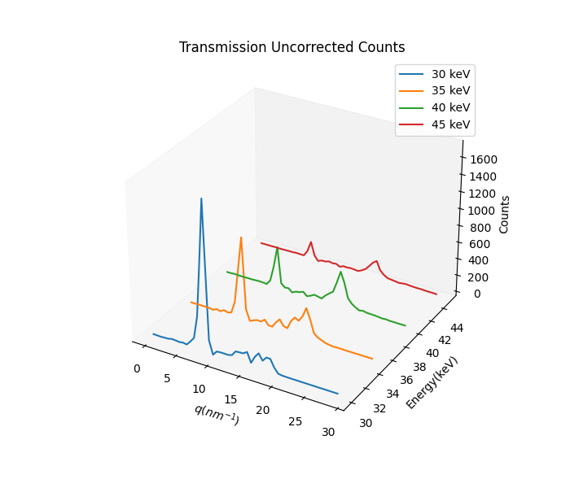
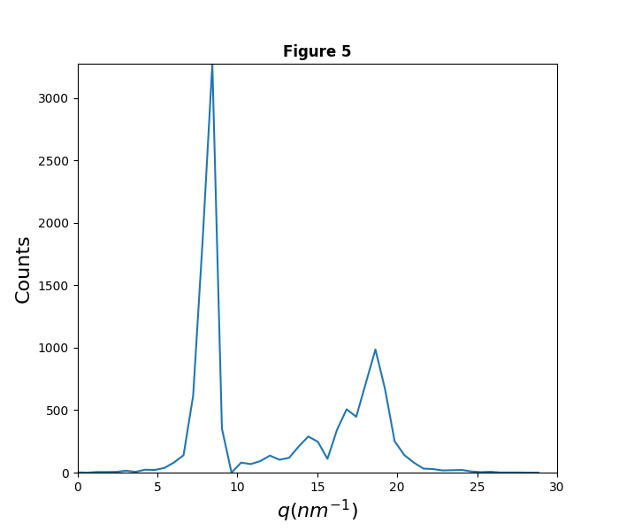

# FDA ORISE Intern Code
By: Andrew Xu
Mentor: Eshan Dahal with Assistance from Aldo Badano

**Purpose**

This repository contains Open-Source Data Analysis Software using Python libraries (`Tkinter`, `NumPy`, and `Matplotlib`) to conduct Spectroscopic Photon Counting Analysis with a built-in UI. It transfers Hexitech files into graphable data to detect radiation.

# Structure and Input/Output

There are three Python files: function, main, and hxtV3Read. Here is what you'll find in each:
1. `main.py`: User interface components
2. `function.py`: data analysis and plotting
4. `hxtV3Read.py`: contains the Hexitech file reading code.
To run the program, the user must run 'main.py'.

## Input

Once the program is run, it will prompt the user to browse two Hexitech files for analysis and 4 inputs:
1. **Bin Start**: The bin layer of the program will begin analysis on
2. **Bin End**: The bin layer of the program will end analysis on
3. **Bin Width**: The bin layer interval the program will analyze, from bin start to bin end.
4. **Energy Window**: The bin layer interval the program will analyze and put onto 3d graphs.

## Output

6 graphs will be produced from the inputs:
| Figure # | Description |
| ------------- | ------------- |
| 1 |: Color mesh of the counts for each pixel of each Energy window interval created :|
| 2 |: Color mesh of the counts for each pixel of the overall interval (bin start to bin end) :|
| 3 |: Reference graph for graph #2 :|
| 4 |: 3D Graph of the combined counts of every possible interval created through the energy window :|
| 5 |: The difference in counts for each pixel between the sample and the background data :|
| 6 |: The counts for both the sample and background data (2 lines) :|

- Graph #1: A color mesh of the counts for each pixel of each Energy window interval created
- Graph #2: A color mesh of the counts for each pixel of the overall interval (bin start to bin end)
- Graph #3: A reference graph for graph #2
- Graph #4: 3D Graph of the combined counts of every possible interval created through energy window
- Graph #5: The difference in counts for each pixel between the sample and the background data
- Graph #6: The counts for both the sample and background data (2 lines).

## Sample Input and Output

- Background Hexitech File: "2020_aug31_1mA_300s_syringe_empty.hxt"
- Sample Hexitech File: "2020_aug31_1mA_300s_caffeine.hxt"
- Bin Start: 30
- Bin End: 45
- Bin Width: 1
- Energy Window: 5

  
| # | Figure | # | Figure | # | Figure |
| ------------- | ------------- | ------------- | ------------- | ------------- | ------------- |
| 1  |:   :| 2  |   | 3  |   |
| 4  |   | 5  |   | 6  |   |
